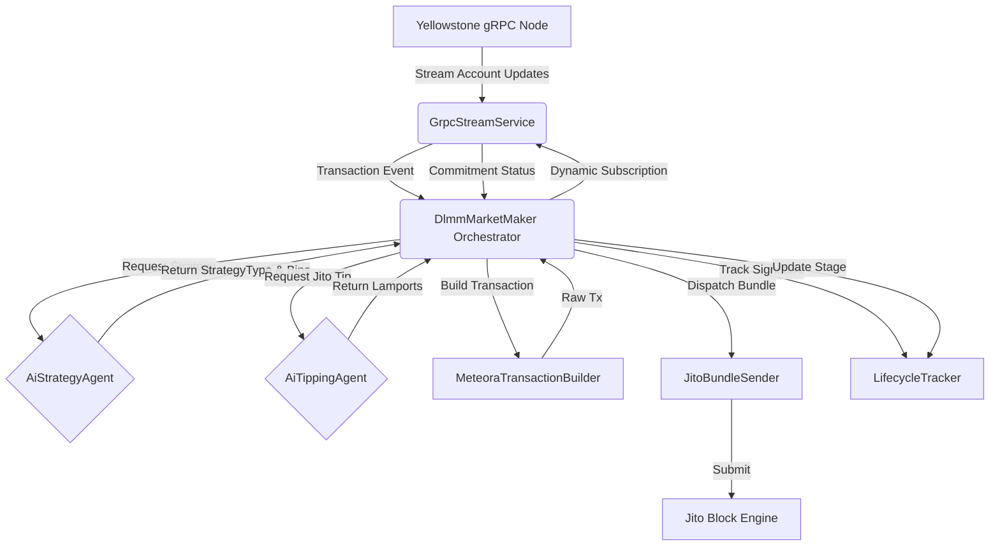

# Intelligent DLMM Transaction Stack Architecture

## System Architecture Overview

The Intelligent DLMM Bot is a sophisticated, highly-decoupled transaction stack designed to provision liquidity on Meteora Dynamic Liquidity Market Makers (DLMMs) while executing trades through Jito MEV bundles. It utilizes real-time Yellowstone gRPC streams for data ingestion and a Dual-Agent AI system (Tip Intelligence and LP Strategy Intelligence) to make autonomous operational decisions.

## Key Components

### 1. Data Ingestion Layer (`GrpcStreamService`)
Maintains a high-performance `ClientDuplexStream` connection to a Yellowstone Geyser node.
- Subscribes to target DLMM pool updates.
- Supports dynamic `transactionsStatus` subscriptions to track the lifecycle of submitted transactions.

### 2. Market Maker Orchestrator (`DlmmMarketMaker`)
The central controller that coordinates the flow of data between the stream, AI agents, and execution layer.
- Implements the `submitWithRetry` loop.
- Manages fault injection and timeout resolutions.

### 3. Dual AI Agent Layer
Completely separated from the core transaction building to allow hot-swapping of models.
- **`AiTippingAgent`**: Analyzes network congestion and returns the optimal `jito_tip_lamports`.
- **`AiStrategyAgent`**: Analyzes pool volatility and directional order flow to determine the optimal DLMM strategy (`Spot`, `Curve`, `BidAsk`) and dynamic bin ranges (e.g. `[-20, +20]`).

### 4. Transaction Building & Execution (`MeteoraTransactionBuilder`, `JitoBundleSender`)
- **Builder**: Fetches recent blockhashes, appends Compute Budget instructions, and signs the transaction.
- **Sender**: Wraps the signed transaction and a Tip instruction into a Jito Bundle and dispatches it directly to the Jito Block Engine, bypassing the public mempool.

### 5. Telemetry & Tracking (`LifecycleTracker`)
Records timestamps across commitment stages (`submitted` -> `processed` -> `confirmed` -> `failed`). Outputs a JSONL file for bounty analysis.

---

## Data Flow Diagram

---

## Failure Handling Strategy

The system is designed to handle common Solana network failures gracefully through an autonomous retry loop.

1. **Failure Detection**: 
   - The Orchestrator sets up a 60-second timeout promise upon submission.
   - It listens to the `transactionsStatus` stream for the signature.
2. **Blockhash Expiry (Timeout)**:
   - If the stream does not emit a confirmation within 60 seconds, the promise resolves as `'failed'` with reason `"Blockhash Expired (Timeout)"`.
3. **Autonomous Retry**:
   - The orchestrator detects the failure, logs the AI's reasoning (e.g., "Network congestion caused delay or bundle dropped. Re-fetching blockhash and recalculating tip...").
   - It increments the retry counter, fetches a *new* blockhash, asks the AI for a *new* tip (which will likely be higher due to the prior failure), and resubmits the bundle.
4. **Fault Injection**:
   - The system supports a `SIMULATE_BLOCKHASH_EXPIRY=true` flag that enforces a deliberate 65-second sleep *before* sending the built transaction to Jito, intentionally triggering an expired blockhash failure to demonstrate the AI's autonomous retry logic in a live environment.
