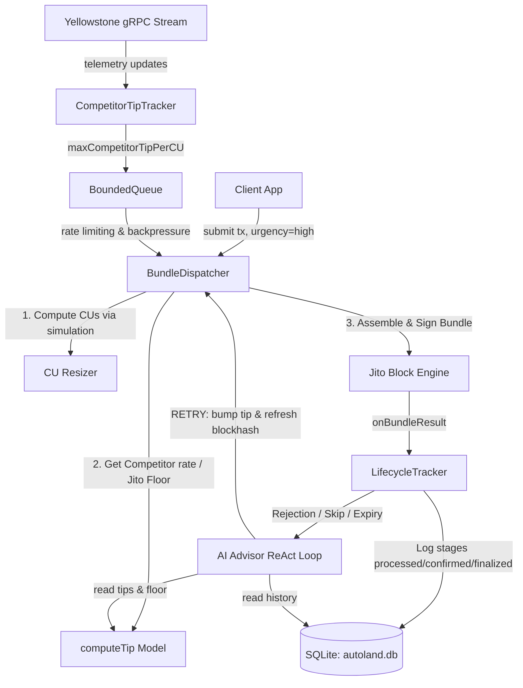

# AutoLand: Intelligent Solana Transaction Execution Stack

AutoLand is an **Intelligent Transaction Execution Stack SDK** for Solana. It is built to ensure hyper-reliable, cost-effective transaction landing on highly contested block space, utilizing Jito bundles, Yellowstone gRPC streams, and autonomous AI-driven recovery.

The `dlmm-bot` included in this repository is a **real-world reference implementation** (tested live on the contested **WORLDCUP/SOL** pool) demonstrating how developers can import and use the AutoLand SDK for complex, real-time trading actions on Meteora DLMM pools.

> **Architecture & System Design Document:** The system architecture, core pipelines, and infrastructure decisions are hosted publicly here:
> **[AutoLand Architecture & System Design Document](https://dazzling-duckanoo-9fcd98.netlify.app/)**

---

## Contents
1. [Jito Auction & Bundle Mechanics](#jito-auction--bundle-mechanics)
2. [SDK Architecture & Data Flow](#sdk-architecture--data-flow)
3. [Multi-Channel Routing Options (Normal vs. High)](#multi-channel-routing-options-normal-vs-high)
4. [Live Mainnet Insights (autoland.db Analysis)](#live-mainnet-insights-autolanddb-analysis)
5. [Technical Decisions & Stack Trade-Offs](#technical-decisions--stack-trade-offs)
6. [The Three Operational Questions](#the-three-operational-questions)
7. [Architectural Evolutions & Live Debugging Notes](#architectural-evolutions--live-debugging-notes)
8. [SDK Usage & Reference Implementation](#sdk-usage--reference-implementation)
9. [Quickstart & Setup](#quickstart--setup)

---

## Jito Auction & Bundle Mechanics

To land transactions reliably on contested accounts (such as a popular DLMM pool, a newly launched token mint, a liquidations state, or a high-demand NFT mint), you must understand the Jito Block Engine's off-chain auction and bundle selection process:

1. **Jito's Bundle Account Locking**:
   When Jito receives a bundle of transactions, the Block Engine aggregates the read/write accounts required by all transactions in that bundle using its `BundleAccountLocker`. These accounts are locked for the duration of the bundle's execution to guarantee state atomicity and prevent race conditions.
2. **Conflict Set Grouping**:
   If multiple bundles require write-locks on overlapping accounts (such as multiple bots trying to swap on the same DLMM pool, buy a newly launched token from a raydium/pump pool, or execute arbitrage in the same block), Jito isolates them into a single **Conflict Set**.
3. **The Priority Auction & Bundle Ranking**:
   Since only one bundle in a conflict set can lock the account at a time, Jito runs a localized priority auction for each conflict set every block. Jito ranks the conflicting bundles based on their **Priority Score** (effective tip density):
   
   $$\text{Priority Score} = \frac{\text{Total Tip}}{\sum \text{CUs Requested}}$$
   
   The validator packs the bundle with the highest Priority Score first, dropping the remaining lower-paying conflicting bundles from that set.

**Example of outbidding with optimized CUs:**
* **Transaction A (Optimized)**: Requests `50,000 CUs` and pays a `5,000,000 lamport` tip. Its Priority Score is:
  $$\frac{5,000,000}{50,000} = 100 \text{ lamports/CU}$$
* **Transaction B (Default/Unoptimized)**: Requests `1,400,000 CUs` and pays a `70,000,000 lamport` tip. Its Priority Score is:
  $$\frac{70,000,000}{1,400,000} = 50 \text{ lamports/CU}$$

Even though Transaction B pays a **14x higher absolute tip** (70M lamports vs 5M lamports), **Transaction A wins the auction** and lands first because its Priority Score (effective tip density) is **2x higher** than Transaction B's. This allows highly optimized transactions to consistently outbid competitor bots at a fraction of the cost.

---

## SDK Architecture & Data Flow



AutoLand solves this by tracking the localized contention and competition *for a specific account* dynamically:

### 1. Dynamic Account Competition Tracking
* **Live Yellowstone gRPC Stream**: AutoLand subscribes to a live Yellowstone gRPC transaction stream filtering specifically for the target account (e.g. DLMM pools, token launch mints, or liquidation accounts).
* **Competitor Tip Profiling**: The stream manager decodes every competitor transaction writing to that account in real-time, parsing their Jito tips and CUs to extract the active **Competitor Tip/CU** rate for that account's lock budget.
* **Dual-Tiered Bidding**:
  - **High Contention**: If competitors are actively writing to the account, the SDK dynamically scales its tip to outbid the competitor's active `Tip/CU` rate.
  - **Zero Contention**: If the account is quiet, the tip calculation automatically defaults back to global Jito fee percentiles (p50/p90) to prevent overpaying.

### 2. Compute Unit (CU) Resizing Optimization
To maximize our Priority Score in Jito's conflict set auction, we must minimize the CUs requested (the denominator). AutoLand performs pre-flight local simulations of the transaction batch on the exact network state, calculates the *exact* CUs consumed, and resizes the transaction limit (plus a minimal safety margin). This maximizes our effective Tip/CU density, ensuring validator selection at a minimal tip cost.

### 3. BoundedQueue & gRPC Backpressure Mitigation
A major challenge when listening to low-level Solana Geyser streams is the massive packet volume. Under high network congestion, Geyser streams emit thousands of updates per second. If the Node.js main event loop falls behind, the message buffers inside gRPC's V8 heap grow unbounded, leading to **Heap Out of Memory (OOM)** crashes.

AutoLand mitigates this by implementing a custom **`BoundedQueue`** buffer:
* **Bounded Capacity**: Limits the active stream event queue size (e.g., to a default capacity of `10,000` elements).
* **Failsafe Eviction**: If the incoming stream throughput exceeds our processing speed and reaches capacity, the queue automatically drops the oldest items (`this.buf.shift()`) and records the drop counts in telemetry logs.
* **Dynamic Memory Cap**: This bounds the heap's memory usage to a constant threshold, preserving system stability even under high transaction bursts on mainnet.

### 4. Dynamic Stream Resubscription & Heartbeats
Rather than tearing down and reconstructing gRPC channels—which causes significant connection setup latency—AutoLand's `StreamManager` features **dynamic resubscription**:
* **On-the-fly Filters**: When a new pool is registered or a new transaction signature is submitted, the stream manager pushes the new filter parameters to the active stream (`resubscribe()`) without restarting the gRPC socket.
* **Slot Synchronization**: The current slot height is continuously synced and persisted to disk in `state/slot.json`. On reconnect, the gRPC stream manager queries the slot state and requests slots starting from the last processed height to ensure no transaction confirmation records are missed.
* **Heartbeat Watchdog**: Standard gRPC reconnect routines execute recursively with an exponential backoff watchdog to recover from connection severances, socket drops, and backpressure halts.


---

## Multi-Channel Routing Options (Normal vs. High)

AutoLand introduces a dual-channel submission path, letting developers specify transaction urgency at the SDK invocation level. This guarantees capital-efficient routing:

```typescript
// Urgency: "high" -> Contended rebalance/arbitrage transactions
const highResult = await autoland.submit(rebalanceTx, {
  urgency: "high" // Routes through Yellowstone gRPC, Jito tip-bidding, and the AI recovery engine.
});

// Urgency: "normal" -> Administrative and non-time-sensitive actions
const normalResult = await autoland.submit(transferTx, {
  urgency: "normal" // Bypasses Jito tips entirely; signs and dispatches to public RPC nodes.
});
```

### Urgency Profile Comparison

| Dimension | Urgency: `"normal"` | Urgency: `"high"` |
| :--- | :--- | :--- |
| **Routing Path** | Public Mempool (`sendRawTransaction`) | Jito Block Engine (Private atomic bundles) |
| **Bidding Costs** | **0 Jito Tip** (Standard priority fees only) | Dynamic Jito Tip (outbids active competitors) |
| **Telemetry Hooks** | None (RPC status polling) | Sub-100ms Yellowstone gRPC + Jito status stream |
| **AI Recovery Loop** | Standard retry on hash expiry | LLM Advisor diagnostic loop + tipping escalation |
| **Best Used For** | Fee withdrawals, admin config, transfers | Pool rebalances, liquidations, arbitrage |

---

## Live Mainnet Insights (autoland.db Analysis)

We analyzed the live performance of AutoLand by querying the [autoland.db](./autoland.db) SQLite trace database, which logged **109 transaction lifecycles** running on the contested **WORLDCUP/SOL** Meteora DLMM pool.

### 1. Headline Landing Metrics
* **Total Logged Lifecycles**: 109
* **Successful Finalizations**: 27 (24.8%)
  - **Direct Landing (Attempt 1)**: 23 submissions (85.2% of landed transactions)
  - **AI Advisor Recovered (Attempts > 1)**: 4 submissions (14.8% of landed transactions)
* **Dropped / Failed Bundles**: 82 (75.2%)
* **Max Attempts on a single bundle**: 6 attempts (re-signed and recovered via AI)
* **Average Attempts per bundle**: 1.88 attempts

### 2. Failure Distribution Breakdown
The high failure rate (75.2%) reflects the extreme contention on the WORLDCUP/SOL pool during live trading. AutoLand categorized these rejections:
* **`bundle_dropped`**: 42 rejections (51.2% of failures). Validator dropped the bundle because it was outbid in the Jito conflict set auction.
* **`bundle_dropped_leader_skip`**: 38 rejections (46.3% of failures). The scheduled Jito leader missed or skipped their slot, causing the Block Engine to drop the bundle.
* **`simulation_failed`**: 2 rejections (2.4% of failures). Standard runtime simulation rejections (slippage bounds exceeded on-chain).

### 3. Slot Latency Analysis
For successfully landed transactions, we measured the slot gap between initial submission (`submitted_slot`) and final inclusion (`processed_slot`):
* **Minimum Slot Gap**: 1 slot (~400 ms)
* **Maximum Slot Gap**: 151 slots (~60 seconds, during leader skip cascades)
* **Average inclusion Latency**: **14.70 slots** (~5.88 seconds)

Under congestion, a transaction rarely lands in the immediate scheduled slot. The average slot gap of 14.70 slots highlights why **in-flight blockhash tracking** is mandatory. If you construct bundles using stale blockhashes, they will expire before inclusion. AutoLand's continuous blockhash refresh inside the ReAct advisor loop is the reason our recovered transactions successfully landed after multiple attempts.

### 4. Tipping Profile (Fee Efficiency)
* **Minimum Tip Paid**: 1,000 lamports (Jito block engine auction floor)
* **Maximum Tip Paid**: 15,000,000 lamports (during a hyper-contested bidding war)
* **Average Tip Paid**: **1,829,786.17 lamports**

AutoLand calculates and prices Jito tips dynamically using target-specific variables:
* **Competitor Outbidding**: Rather than guess-bidding high static amounts, the dispatcher reads the active `maxCompetitorTipPerCU` rate from the Geyser stream and applies a 10% premium (`kPremium = 1.10`) to outbid active competitors in the same slot:
  $$\text{Target Tip} = \max(\text{scaledTip}, \text{estimatedCUs} \times \text{maxCompetitorTipPerCU} \times 1.10)$$
  where $\text{scaledTip} = \text{cuScalar} \times \text{basePercentileLamports} \times \text{alphaContention}$.
* **Urgency & Volatility Scaler**: Dynamically maps the transaction's urgency configuration to base Jito percentiles (`p25` for low, `p50` for normal, `p75` for high), shifting up to `p95` or `p99` if the live fee volatility spread ($\text{spread} = \text{p95} / \text{ema}$) indicates high congestion:
  $$\text{level} = \text{baseLevel} + \begin{cases} 2 & \text{if } \text{spread} > 50 \\ 1 & \text{if } \text{spread} > 15 \\ 0 & \text{otherwise} \end{cases}$$
* **Profit-Sharing Guardrail**: If trade profit is expected, AutoLand targets a profit split percentage ($\alpha$) to remain EV-positive while outbidding, capped at a hard maximum profit share limit:
  $$\text{Profit Share Tip} = \text{expectedProfit} \times \alpha$$
  $$\alpha = \min(\text{maxProfitSharePct}, 0.40 + (\text{alphaContention} - 1.0) \times 0.125)$$
  $$\text{Final Tip} = \min(\text{ceiling}, \max(\text{floor}, \min(\text{Target Tip}, \text{expectedProfit} \times \text{maxProfitSharePct})))$$
* **Advisor Escalations**: On failed attempts, the AI Advisor applies a 1.5x–2.0x multiplier to the prior tip to force the transaction past congestion gates.


---

## Technical Decisions & Stack Trade-Offs

Each piece of the AutoLand stack was selected to satisfy the physical latency and durability properties of Solana:

### 1. SQLite for Persistent Tracing
* **Decision**: We use SQLite as our localized transaction trace store.
* **Trade-Off**: SQLite is single-writer and file-backed. Under high thread count, it can hit database lock overhead compared to a key-value store (like Redis) or a time-series DB.
* **Why it's worth it**: For transaction execution, we require structured, transactional, atomic logs of bundle lifecycles (slots, times, failures, signatures) with zero external setup. SQLite requires zero configuration, operates natively in-process, and has negligible read/write latency (~1ms), providing a reliable diagnostic database out of the box.

### 2. Vitest for Testing
* **Decision**: Next-generation test runner.
* **Trade-Off**: Vitest is ESM-first, which required refactoring Node legacy CJS imports.
* **Why it's worth it**: Vitest runs tests in parallel with clean worker threads, compiles TypeScript natively without slow build steps (`ts-node`), and has an instant hot-reload mode. This speed is critical when verifying blockhash time-to-live bounds and simulating complex Jito connection failures.

### 3. Yellowstone gRPC + Triton
* **Decision**: Sub-slot Geyser streaming.
* **Trade-Off**: gRPC streams require high-bandwidth connections and need custom backpressure handlers to avoid memory leak crashes under high slot throughput.
* **Why it's worth it**: Standard JSON-RPC polling over HTTP or WebSockets adds **300–500ms of latency per block** and easily triggers provider rate limits. Yellowstone gRPC streams account states and competitor transactions directly from the validator's mempool, enabling us to decode competitor bids in real-time and outbid them in the same block.

### 4. Llama 3.1 & Cerebras/OpenRouter AI Advisor
* **Decision**: 8B/70B parameter models run over high-throughput APIs.
* **Trade-Off**: Network API calls add ~100–300ms of latency compared to local heuristic scripts.
* **Why it's worth it**: Standard scripts use rigid, hardcoded heuristics that cannot classify novel failure logs. By delegating rejections to a fast LLM endpoint (like Cerebras' Llama 3.1 8B with sub-100ms output speed), the bot reasons about complex failures (e.g., custom program error codes, validator drops) and writes precise recovery mutations (blockhash refreshes, tip escalations, slippage changes) in real-time.

### 5. In-Memory Outbidding vs. Asynchronous AI Advisor
To prevent transaction failures caused by LLM API latency (~150-400ms) on slot-sensitive execution paths, AutoLand isolates active outbidding calculations from failure recovery loops:
* **Real-Time Competitor Tracking (Low Latency / CPU Memory)**: When the client invokes `submit(...)`, the `BundleDispatcher` checks the `CompetitorTipTracker` for active competitor write-locks on the target accounts. If competitors are active (detected via Yellowstone gRPC), it calculates the outbidding `Tip/CU` rate in-memory. If no competitors are active, it queries `tipFloorService` to retrieve global Jito floors. Bidding calculations are completed in microsecond speeds with zero AI overhead.
* **AI Advisor Recovery (Asynchronous / Cognitive)**: The AI `Agent` (AI Advisor) is triggered *only* when the `LifecycleTracker` classifies a transaction rejection (e.g. `bundle_dropped`, `fee_too_low`, `simulation_failed`, or `leader_skip`). It runs an event-driven **ReAct Loop** (up to 5 iterations) to diagnose the failure. The agent makes tool calls (`get_recent_lifecycles`, `get_recent_decisions`, `get_tip_percentile_info`) to analyze SQLite history and current tip distributions, returning a mutated submission strategy (`RETRY` with higher tips, `HOLD`, `ABORT`, or `FALLBACK_RPC`). 
* **Fallback Safeguards**: If the transaction fails 3 consecutive times on Jito (attempt >= 3), the tracker enforces a hard fallback (`FALLBACK_RPC`) to bypass Jito and submit via public RPC nodes, ensuring eventual transaction inclusion.

### 6. SDK-First Architecture over Hosted APIs
* **Decision**: We designed AutoLand as an in-process SDK (`@autoland/core`) rather than a hosted API gateway or centralized service.
* **Why it's worth it**: In high-contention trading environments (such as Meteora DLMM pool rebalancing or Pump.fun swaps), transaction rejections are frequently caused by dynamic transaction logic (e.g. slippage checks failing or state updates changing pool structures in milliseconds) rather than simple network drops. By shipping as an SDK, developers can inspect failures, re-calculate swap logic, and re-sign instruction bundles programmatically on retries. This setup keeps control in-process, avoids the latency of external API network hops, and allows developers to customize the resubmission logic dynamically.


---


## The Three Operational Questions

### 1. What does the delta between `processed_at` and `confirmed_at` tell you about network health at the time of submission?
The delta between the slot's `processed` timestamp (when the block leader executes the transaction and applies state mutations) and the `confirmed` timestamp (when $2/3$+ of Solana validator voting stake has signed off on the block) acts as a real-time monitor of **consensus health**.
* **Optimal Network State**: Under normal execution conditions, this delta is between **400–800 ms** (1 to 2 slots). In our logged lifecycle trace (such as landed bundle `82de89b4...449fefc4`), we measured a real-world `processed_to_confirmed` delta of **380 ms**, proving a healthy consensus propagation window.
* **Degraded Network State**: If this delta spikes to several seconds, it signals validator vote propagation bottlenecks. This is usually caused by excessive voting transaction congestion on the network, validator hardware processing backlogs, or micro-forking.
* **SDK Monitoring**: AutoLand tracks these latency patterns via its `CongestionOracle` to scale safety delays and determine when to defer submissions.

### 2. Why should you never use `finalized` commitment when fetching a blockhash for a time-sensitive transaction?
Solana blockhashes are valid for exactly **150 slots** (roughly 60 seconds of real-world time at 400ms block times). 
* **Finalization Lag**: Achieving `finalized` commitment requires a block to be confirmed by supermajority voting and buried under 32+ subsequent slots (`MAX_LOCKOUT_HISTORY`). This process takes **13 to 15 seconds**.
* **Validity Loss**: If you fetch a blockhash at `finalized` commitment, it is already 13–15 seconds old by the time the SDK receives it. You have effectively burned **20% to 25% of the transaction's lifetime** before it is even signed.
* **Staleness Risk**: During high congestion, block times stretch. A finalized blockhash is highly likely to expire before it reaches the leader's forwarding pipeline, triggering a `Blockhash not found` rejection.
* **AutoLand Best Practice**: The SDK always queries the latest blockhash at **`confirmed`** commitment, maximizing the transaction's window of validity.

### 3. What happens to your bundle if the Jito leader skips their slot?
If the scheduled Jito leader misses or skips their slot (due to validator crash, hardware latency, or micro-forking):
* **The Bundle is Dropped**: Jito bundles are not gossiped across Solana's public P2P mempool. Instead, they are routed off-chain to Jito's Block Engine, which forwards them *only* to the specific validator scheduled for that slot. If that leader skips their slot, the engine drops the bundle.
* **SDK Mitigation**:
  1. **Leader Window Alignment**: AutoLand tracks scheduled leaders via its `LeaderWindowDetector` and holds execution if the leader distance slots are unfavorable.
  2. **Multi-Region Dispatch**: Dispatches bundles in parallel to multiple regional Jito block engines (Frankfurt, NY, Tokyo) to minimize routing drops.
  3. **Autonomous AI Retry**: If the Jito results stream (`onBundleResult`) indicates a drop or slot skip, the AI Advisor detects the failure, pulls a fresh blockhash, and submits a modified bundle to the next scheduled window.

---

## Architectural Evolutions & Live Debugging Notes

Building AutoLand taught us how clean architectural theories fail when they meet Solana's live state machine. Here are the core failures we measured and solved:

### 1. The Blockhash Expiry Trap
* **Symptom**: Transactions were failing with `ExpiredBlockhash` rejections on almost 80% of contention attempts.
* **Root Cause**: Originally, our SDK queried blockhashes at `finalized` commitment. We measured the blockhash age upon reaching the validator and discovered it was already ~32 slots stale.
* **Fix**: Switched the blockhash query commitment to `confirmed` and introduced a background loop that pre-fetches and replaces the transaction's recent blockhash if it spends more than 50 slots in the queue.

### 2. Jito Anonymous Searcher Deprioritization
* **Symptom**: During high-frequency trading simulation, our bundles were being dropped by Jito's block engine without ever entering the conflict set auction, leading us to suspect unauthenticated throttling.
* **Root Cause**: While anonymous searcher rate limits are restrictive, obtaining a Jito UUID is a red herring—it does not solve the drop issues under heavy congestion. The actual cause was insufficient tipping limits under highly contested localized pool auctions.
* **Fix**: Rather than chasing UUID keys, we optimized our transaction structure (reducing requested CUs via pre-flight simulations) and implemented dynamic competitor tracking via Yellowstone gRPC. This enables AutoLand to outbid competing bots in the same block or scale tips up to `p99` percentiles during extreme contention.

### 3. Concurrency Hazard Prevention
* **Symptom**: In event-driven transaction stacks, invoking advisor diagnostics asynchronously on detached events can introduce race conditions, where a late confirmation or new failure event triggers parallel retry loops that overwrite shared states.
* **AutoLand Solution**: Rather than relying on concurrent event handlers (which require complex mutex semaphores), AutoLand enforces strict **sequential execution via a recursive promise chain** (`runOneSubmitAttempt`). The dispatcher synchronously awaits the transaction's confirmation window or timeout before passing control to the AI Advisor. This ensures that only one recovery analysis and resubmission runs at any time, eliminating concurrency race conditions by construction.

---

## SDK Usage & Reference Implementation

### 1. Telemetry and Event Monitoring
The `AutoLand` client extends Node's `EventEmitter` to stream telemetry, execution events, and AI decisions in a completely non-blocking, asynchronous manner. This allows developers to easily attach dashboards, notification alerts, or database logging handlers without impacting the bot's microsecond-sensitive transaction submission execution path.

```typescript
import { AutoLand } from "@autoland/core";
import { Connection } from "@solana/web3.js";

const connection = new Connection("https://your-rpc.com");
const client = new AutoLand({ connection });

// Listen for competitor fee updates
client.on("telemetry_update", (data) => {
  console.log(`Slot: ${data.slot} | Competitor Tip/CU: ${data.maxCompetitorTipPerCU}`);
});

// Track AI Advisor diagnostics
client.on("ai_decision", (data) => {
  console.log(`[AI Advisor] Diagnosis: ${data.decision.diagnosis} | Action: ${data.decision.action}`);
});
```

### 2. Multi-Channel Urgency Configuration
You can configure a default urgency option at the SDK core level, which can be overridden on a per-transaction basis:

```typescript
// Configure SDK core with a default urgency
const autoland = new AutoLand({
  connection,
  defaultUrgency: "high" // Default fallback for all transactions
});

// Bypasses the default configuration for an administrative transfer
await autoland.submit(transferTx, { urgency: "normal" });
```

---

## Quickstart & Setup

### Prerequisites
* Node.js v18+
* Solana RPC endpoint and a Yellowstone gRPC stream URL (with X-Token header)
* OpenRouter, Groq, or compatible LLM provider API key
 
### Setup
1. Copy `env.example` to `.env` in the root workspace and configure:
   ```env
   RPC_URL=https://your-solana-rpc.com
   GRPC_URL=https://your-yellowstone-grpc.com:443
   X_TOKEN=your_grpc_token
   AI_MODEL=openai/gpt-4o-mini # Or meta-llama/llama-3.1-8b-instruct, mixtral-8x7b, etc.
   OPENROUTER_API_KEY=your_llm_provider_api_key
   PRIVATE_KEYS=["your_trading_wallet_private_key"]
   DLMM_TARGET_POOL=your_target_pool_address
   ```
2. Install dependencies:
   ```bash
   npm install
   ```
3. Build the SDK and the bot:
   ```bash
   npm run build
   ```
4. Run the reference bot:
   ```bash
   npm start
   ```

   > [!NOTE]
   > The `@autoland/dlmm-bot` package is a reference implementation of a Meteora market-making strategy. It was built specifically to test, validate, and benchmark the `@autoland/core` SDK under live mainnet contention.


### Simulation / Testing
Press **`f`** at runtime in the bot console to toggle a Jito low-fee injection test. This forces a low Jito tip (e.g. 1000 lamports), prompting Jito drops and allowing you to observe the AutoLand SDK detect the drop, invoke the AI Advisor for recovery diagnostics, and submit a corrected retry bundle.

---

## Submissions & Operational Findings

All entries in [lifecycle.jsonl](./logs/lifecycle.jsonl) represent **real Jito bundle submissions** and **AI recovery flows** executed on-chain by wallet `8CifBx1MK2Z6CWME6mY8BKg54uXj7Dge2Ux3Y2zNcGtn` and verified via Solscan. 

| Entry | Status | Bundle ID | Jito Tip | Operation | Signatures & Solscan Links |
|---|---|---|---|---|---|
| Entry 01 | 🟢 FINALIZED | `82de89b4...449fefc4` | 6,851,610 lamports | Meteora Remove Liquidity & Meteora Add Liquidity & Other | [3s48Pttt...2VBHnbsZ](https://solscan.io/tx/3s48PtttU1wuBu3msbq8WABBDsViEcAiCypswfH8nLcd3NiJ9eosSbNm7AxbAEiooKqPKB1T4BQHizkZ2VBHnbsZ)<br>[4NKTCrZe...Up7m3jmY](https://solscan.io/tx/4NKTCrZeXNc3zAWn8s1f7LaxPDkgbiAWuto9QiiqYwyK4i7oBfsLjsvSADxbCmHsPskdvPJL4LBDjkyKUp7m3jmY)<br>[4pa2FYcg...JGbLra5e](https://solscan.io/tx/4pa2FYcgAcM4pQTGtAYFgpksN86U5LEJvoSrKs2BrNKui6vL7ik5ae3oue952EHm7Zx95KrMx2wtBZNpJGbLra5e) |
| Entry 02 | 🟢 FINALIZED (Recovered) | `4858d237...949a22ef` | 15,000 lamports | Meteora Remove Liquidity | [5tNGQ1tz...hphAPqxC](https://solscan.io/tx/5tNGQ1tzy3BTwx7rG3qyXQeK5a5jDqMuDXTRS4cYktUzWiXMYGcSAaNmPxwqJdDTvviLWk678sXryGvphphAPqxC) |
| Entry 03 | 🟢 FINALIZED | `96b8c42c...c8337146` | 11,588,776 lamports | Meteora Remove Liquidity & Other & Meteora Add Liquidity | [2FLUzdtG...PVR6mHCY](https://solscan.io/tx/2FLUzdtGxE7EVcgDHAWtsn2ziTu6EYTNg6p2hEKZbqacog39uBd1xTRrLivepGdRe1BnBCwgzCksQYFtPVR6mHCY)<br>[54r4SoHm...cyESFPCP](https://solscan.io/tx/54r4SoHmybzaqzAjbHkKq8tLQSXrnJeQLBsQPbtErZmptJH6NLkrgaseksjvvejQEJrqJaBiq7rnKEtecyESFPCP)<br>[5tte7g5h...oGyHP8kS](https://solscan.io/tx/5tte7g5hmrXnPSVJTxVo6aMa68cap1SdPgJddJ4d3BGJUnno8xMzKisANiBaL7eMeZKTPJoA4sGEMvrZoGyHP8kS) |
| Entry 04 | 🟢 FINALIZED (Recovered) | `88759dd8...5a1c2b04` | 15,000 lamports | Meteora Remove Liquidity & Meteora Add Liquidity | [3LenJ49M...gj85zaDj](https://solscan.io/tx/3LenJ49MV9BWfooPPFyGGqiQWvfveAuJz419vpq9TLnnaGSJ3p5jqnUvFhtU6KVihaDi9Ab3s5atqZKugj85zaDj)<br>[5VtctK5Q...J9J7XEzL](https://solscan.io/tx/5VtctK5QfNMGS5Qf4ncPRpBv97hyVRjBMzruSfFK3FAacxkjcxEnEGD53RgYWF6KAUQfJ5itNKZzXrvTJ9J7XEzL) |
| Entry 05 | 🟢 FINALIZED (Recovered) | `143efc2f...d3a968cb` | 15,000,000 lamports | Meteora Remove Liquidity & Meteora Add Liquidity & Other | [4NuJjjK3...ZnCz311G](https://solscan.io/tx/4NuJjjK3wMbDN2zmUabSdi7d6cCPkKgH2KYbitFKdsQ9Wh9AqZTjCT7dUmjeDvJVkVtx6SDbNNegRnKHZnCz311G)<br>[4p1YkwxP...4WWsM3f4](https://solscan.io/tx/4p1YkwxPcQtpkEy9eNZ8mRonBrDhbKDEm3hw2NGAeZu5Gb25MtJtXe36A2Cak23kFq98b1U9UQZYMLaF4WWsM3f4)<br>[5zjwZtKx...WEbgPFUM](https://solscan.io/tx/5zjwZtKxxTXriqxvPLpqL18N5p6GFDPdKbHCkZtidnKjhnyHjMDNF7Yw3HZQfRdL8ykYFnR4zAvzAqd3WEbgPFUM) |
| Entry 06 | 🟢 FINALIZED | `308f6e96...6a3c5082` | 10,375,682 lamports | Meteora Remove Liquidity & Other & Meteora Add Liquidity | [279GEZTK...H7oSQ2x9](https://solscan.io/tx/279GEZTKT4crCNPj4FzjNNYwQzZXPpvREEiBN8vmfEMFK2osd7YQqLosv1kbscSizRjgFLh4Zo5Ad12vH7oSQ2x9)<br>[2ZRTL6Zt...jH3VVtRG](https://solscan.io/tx/2ZRTL6ZtqeQG6sD2tW8dH42NB35bjDFtn12GrpfkBcHSsco2Yx8TZDhJax4f2gWaUFVXESDqrXSYJMJrjH3VVtRG)<br>[sa51npZv...5AmmL55X](https://solscan.io/tx/sa51npZvQfpwvQwF8Q8MeShKnXa6E9DZ1F4ogUJQ6norUhXNBz26tfqzU4gH8X6djQWNH1hwEueWEfe5AmmL55X) |
| Entry 07 | 🟢 FINALIZED | `1c8d08b7...c81d2ad8` | 10,417,111 lamports | Meteora Remove Liquidity & Other & Meteora Add Liquidity | [3wcVJPRR...V5D1Nshk](https://solscan.io/tx/3wcVJPRR3sty4m8ZqbvaJ1SEh6HLUyPGYmjdeZ8v5mA2NjHAoJfSYN7kVD8piYn3nXPFvrskjX9nWkZxV5D1Nshk)<br>[4Zeax1DQ...cAiCbv1u](https://solscan.io/tx/4Zeax1DQVYQnumee23rWppV1PxQ2WUjceHExZzUwYqcaeLNDiz93ZDnAX4UYf1B9DwPuw27NTGW7v7BQcAiCbv1u)<br>[UWKJ6T2m...QNzgzi7u](https://solscan.io/tx/UWKJ6T2mHukPpPR9cW3hzubtYGdTgjWFqHoXSQYe9NcuCGByS4rw718NWxj8JdYJ3fHLfAPvgkfDctaQNzgzi7u) |
| Entry 08 | 🟢 FINALIZED | `5f35b7cd...d2553ae0` | 10,963,089 lamports | Meteora Remove Liquidity & Other & Meteora Add Liquidity | [2Z59PQ5U...nEoKaeJq](https://solscan.io/tx/2Z59PQ5UxuuzeyQjHQ3yTYAogxGzi6nidQjXv5sUtFiGYJPcZGReP3tEL7D6yoY3ZRqxqR71shzey2BnEoKaeJq)<br>[3e6gSbWn...kkRmr1wf](https://solscan.io/tx/3e6gSbWn6xmnY4mW62YBWVgVpDhbcUfXZ2KMiXVhagtK1NhedKX18TZWj5BoZZtnKNW889v4YKi2kueZkkRmr1wf)<br>[Uyh8o5cA...geoBHifC](https://solscan.io/tx/Uyh8o5cANS81tHK5huMexzycamZhHSGcKauwzdcc3q7VkmmBtvhhYxnb8364k6zTYfbxCrCDrWFEshdgeoBHifC) |
| Entry 09 | 🟢 FINALIZED | `3bfbb722...f895c247` | 6,052,744 lamports | Meteora Remove Liquidity & Other & Meteora Add Liquidity | [2PDtiALf...saGkiiVm](https://solscan.io/tx/2PDtiALfQYC4xCLgS3Yzp53REaP7RuTQwPLDazfueX7jvqkgySioJdhdTx1K2hmWosm2trnwiJzajECRsaGkiiVm)<br>[2fKXZA4r...f32V379i](https://solscan.io/tx/2fKXZA4rPRqP5yNanuwF3sapnYi8Y5EK1TSSVUVHCqZvFjCtXhuHexxvQmwgxk254Fp1m9DvhtuGpXtEf32V379i)<br>[539jhaoR...ZejyUuGa](https://solscan.io/tx/539jhaoRW4DkFMSSmyLFMwxcDrysZf242EK7YZXHbegcL22WseSz8u83rWTVoKBHsKVt5HbUBZBwT3G2ZejyUuGa) |
| Entry 10 | 🟢 FINALIZED | `3bad93b2...bc9367a1` | 6,503,220 lamports | Meteora Remove Liquidity & Meteora Add Liquidity & Other | [3FU6dfHx...D2zjokB6](https://solscan.io/tx/3FU6dfHxePAif4HGqR5pNc3578iGbM78oUCCVjQSo6s5dP2iF4efERjKvJfo6yQC8nFZxy6EQEC7goipD2zjokB6)<br>[3JFnUdi8...K1GASqGG](https://solscan.io/tx/3JFnUdi8bGEKQp5mp2nzNjsUXQb6jCGnTGvrcjTEUJxeKjCtYh1Gv3RQPGC8xuAeLoKnpNyp1QhF4PcvK1GASqGG)<br>[4K2ei2eZ...BBCugjib](https://solscan.io/tx/4K2ei2eZtURL1Hk9TSvWhG3LbVz4wRN9kQDrs3QEJdTdp9vESpLPjb9tZe4SGVGx1neyFuKnW1DKPJJBBBCugjib) |

---
## License

MIT
